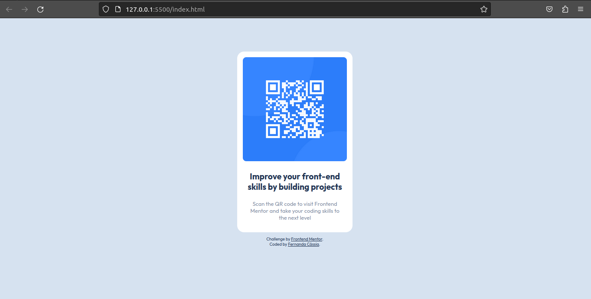
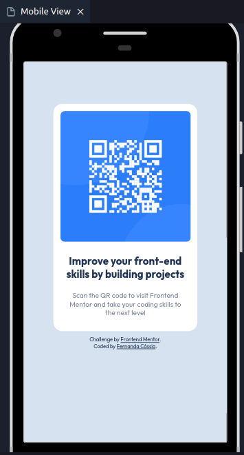

# Frontend Mentor - QR code component solution

This is a solution to the [QR code component challenge on Frontend Mentor](https://www.frontendmentor.io/challenges/qr-code-component-iux_sIO_H). Frontend Mentor challenges help you improve your coding skills by building realistic projects. 

## Table of contents

- [Overview](#overview)
  - [Screenshot](#screenshot)
  - [Links](#links)
- [My process](#my-process)
  - [Built with](#built-with)
  - [What I learned](#what-i-learned)
  - [Useful resources](#useful-resources)
- [Author](#author)
- [Acknowledgments](#acknowledgments)


## Overview

### Screenshot





### Links

- Solution URL: (https://github.com/fercassia/qr-code-challenge)
- Live Site URL: (https://fercassia.github.io/qr-code-challenge/)

## My process

### Built with

- Semantic HTML5 markup
- CSS custom properties
- Flexbox


### What I learned

For me, was difficult to understand how to allign a div in de center. But with some search a got a good result in the beginning

I tried to make a clean code, like using id to identify a element for automation.

```css
@font-face {
    font-family: Outfit;
    src: url(../fonts/Outfit-VariableFont_wght.ttf);
}

body {
    background-color: hsl(212, 45%, 89%);
    display: flex;
    flex-direction: column;
    justify-content: center;
    align-items: center;
    padding: 4.3rem;
}
.qr-containner{
    background-color: hsl(0, 0%, 100%);
    padding: 0.8rem;
    border-radius: 1rem;
}
.text-font-familly{
    font-family: Outfit;
    font-display: flex;
    text-align: center;
    margin-left: auto;
    margin-right: auto;
    width: 14rem
}
.title-challenge{
    color: hsl(218, 44%, 22%);
    font-weight: 700;
    font-size: 1.2rem;
}
.text-challenge{
    color: hsl(220, 15%, 55%);
    font-weight: 400;
    font-size: 0.8rem;
}
.qr-code{
    width: 15rem;
    border-radius: 0.5rem;
}
.author{
    color: hsl(218, 44%, 22%);
    width: 10rem;
    font-weight: 400;
    font-size: 0.6rem;
}

a:link{
    color: hsl(218, 44%, 22%);
}
a:visited{
    color: hsl(218, 44%, 22%);;
}
a:hover{
    color: hsl(0, 100%, 50%);
}

```

## Author

- Frontend Mentor - [@fercassia](https://www.frontendmentor.io/profile/fercassia)

## Acknowledgments

I took some acknowledgement searching on stack overflow, W3Scholl and mdn web docs